# **About Me
Telecommunication Engineer transitioning into a Data Scientist role after completing Data Science Bootcamp. Over 5 years experienced in Radio Access Network field accustomed to perform statistical analysis on KPI Radio statistics. Data Enthusiast equipped with proficiency in Data Science, keen to learn new skill and knowledge. I aspire to be a data scientist because allow me to unravel insights, drive informed decisions, and shape the future through innovative applications of analytics

# **Data Science Projects**
## Tableau - Livestock Production Dashboard

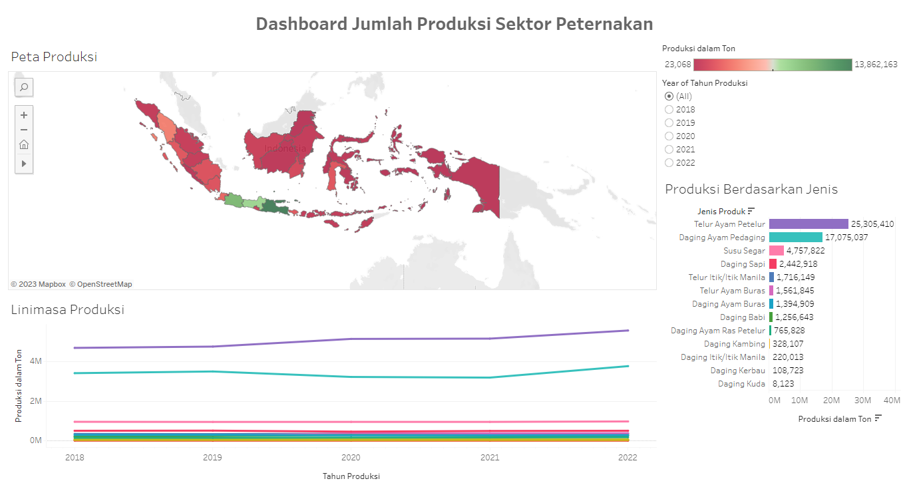

In this project, I created an interactive dashboard using data from bps.go.id and presented it through Tableau Public. The dashboard has three main components. Firstly, a map displays the distribution of livestock sector production in each province, with the ability to filter by selected province. Secondly, a bar chart visualizes production by product type, also filterable by product selection. Lastly, a line chart shows production data from 2018 to 2022. This dashboard provides a clear overview of livestock production across provinces, product types, and their trends over recent years. You can access the dashboard via the provided link. [**Dashboard Link**](https://public.tableau.com/shared/Z775W6Z7C?:display_count=n&:origin=viz_share_link)

## Exam Score Prediction and Model Deployment

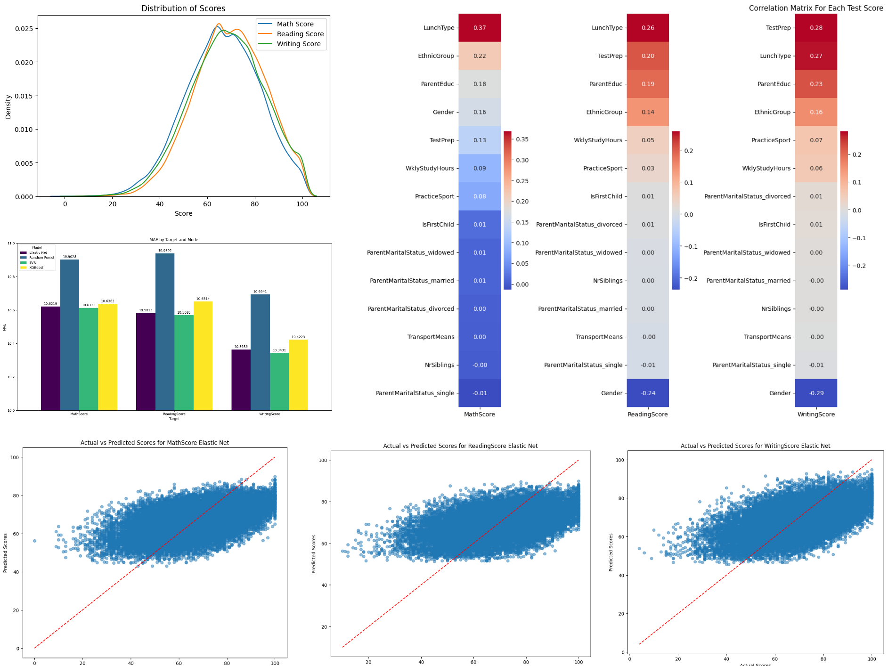

This project aims to predict students' exam scores in Math, Reading, and Writing using machine learning algorithms, including Elastic Net, XGBoost, Random Forest, and SVR. By preprocessing the data, selecting the most appropriate features, and optimizing model parameters, the project seeks to develop accurate predictive models. These models will provide valuable insights into student performance, aiding educators and institutions in identifying students who may require additional support and enabling data-driven decisions to enhance educational outcomes. [**Project Link**](https://github.com/ASatya-J107/Data_Science_Project_7_Exam_Score_Prediction_Model_Deployment/blob/main/Data_Science_Project_7_Exam_Score_Prediction_Model_Deployment.ipynb)

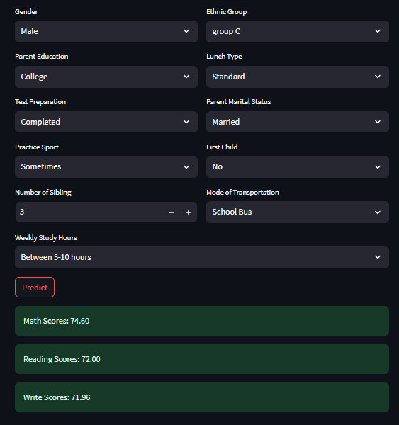

For deployment, we have chosen to implement the Elastic Net regression model within a Streamlit web application. Streamlit provides a user-friendly and interactive interface, allowing educators and stakeholders to easily input student data and obtain predictions for exam scores. This streamlined deployment of the Elastic Net model via Streamlit will empower educational institutions with a user-friendly tool for real-time assessment, facilitating quick decision-making to improve student outcomes and enhance educational strategies. [**Deployment Link**](https://exam-score-prediction.streamlit.app/)

## Binary Classification with Artificial Neural Networks

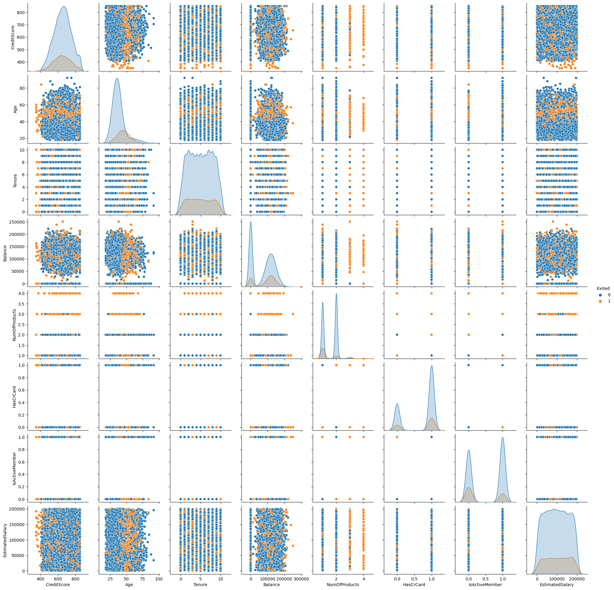

Using an Artificial Neural Network (ANN), this project aims to create a predictive model for customer churn classification. The ANN will analyze customer data, including Credit Score, Geography, Gender, Age, Tenure, Balance, Number of Products, Has Credit Card, Is Active Member, and Estimated Salary, to categorize customers into two groups: those likely to churn and those likely to stay. By training the ANN on historical data, optimizing its parameters, and evaluating its performance, the project aims to provide a powerful tool for identifying and addressing customer churn, ultimately helping the business enhance customer retention strategies and maintain long-term profitability. [**Project Link**](https://github.com/ASatya-J107/Data_Science_Project_6_Artificial_Neural_Network/blob/main/Data_Science_Project_6_Artificial_Neural_Network.ipynb)

## Customer Segmentation through Clustering Analysis

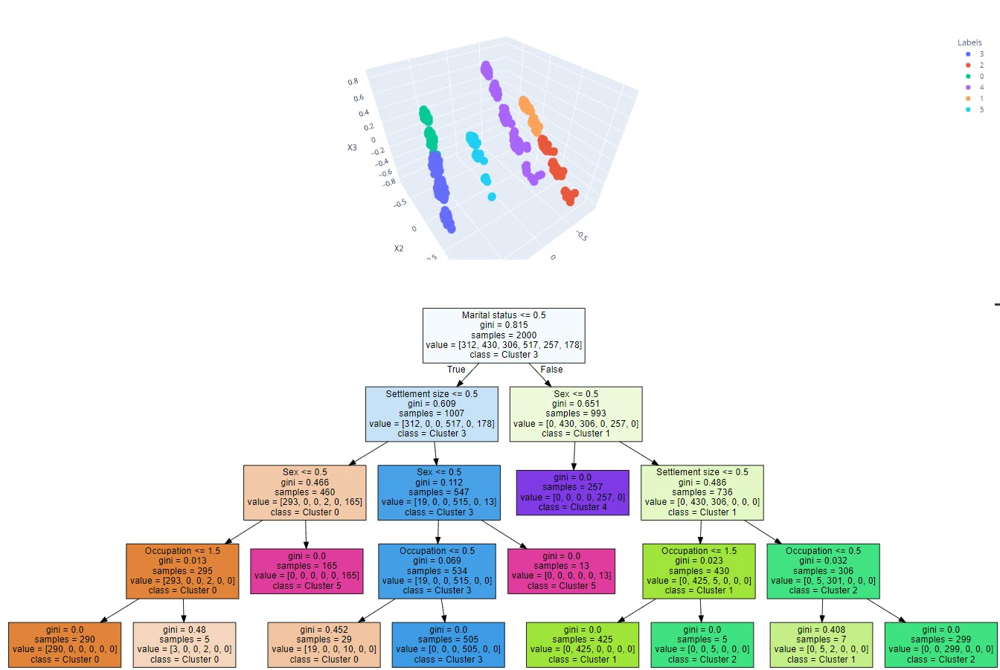

The primary objective of this project was to perform customer segmentation, a crucial process for businesses looking to understand their customer base better. By analyzing various customer attributes and behaviors, we aimed to group customers with similar characteristics into distinct segments or clusters. These segments would help in tailoring marketing strategies, product offerings, and customer experiences to meet the specific needs and preferences of each group. The project involved data collection, preprocessing, and the application of segmentation techniques such as clustering algorithms. The resulting segments provided valuable insights for targeted marketing, improved customer engagement, and overall business growth. [**Project Link**](https://github.com/ASatya-J107/Data_Science_Project_5_Clustering/blob/main/Data_Science_Project_5_Clustering.ipynb)

## Predicting ISP Churn Rates with Classification Models

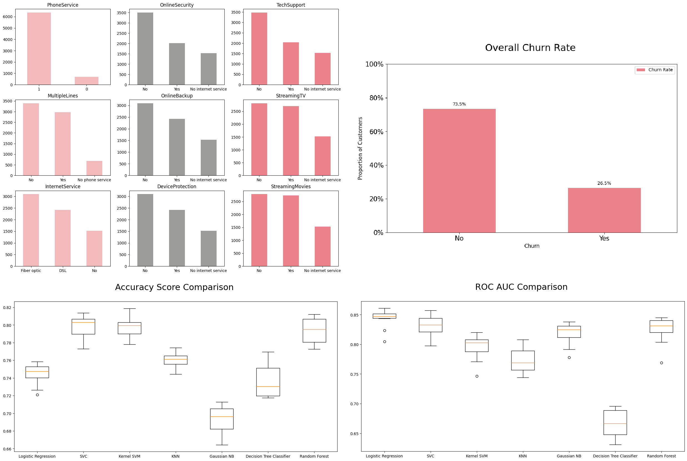

This project centered on analyzing and understanding churn rate dynamics for an Internet Service Provider (ISP). Churn rate, which refers to the rate at which customers discontinue their subscriptions or switch to other providers, was a key metric of interest. The project aimed to identify the factors influencing churn, such as service quality, pricing, and customer satisfaction. Through comprehensive data analysis and modeling, the project aimed to provide insights and recommendations to reduce churn and enhance customer retention strategies for the ISP. [**Project Link**](https://github.com/ASatya-J107/Data_Science_Project_4_Classification/blob/main/Data_Science_Project_4_Classification.ipynb)

## Property Price Prediction Model with Regression

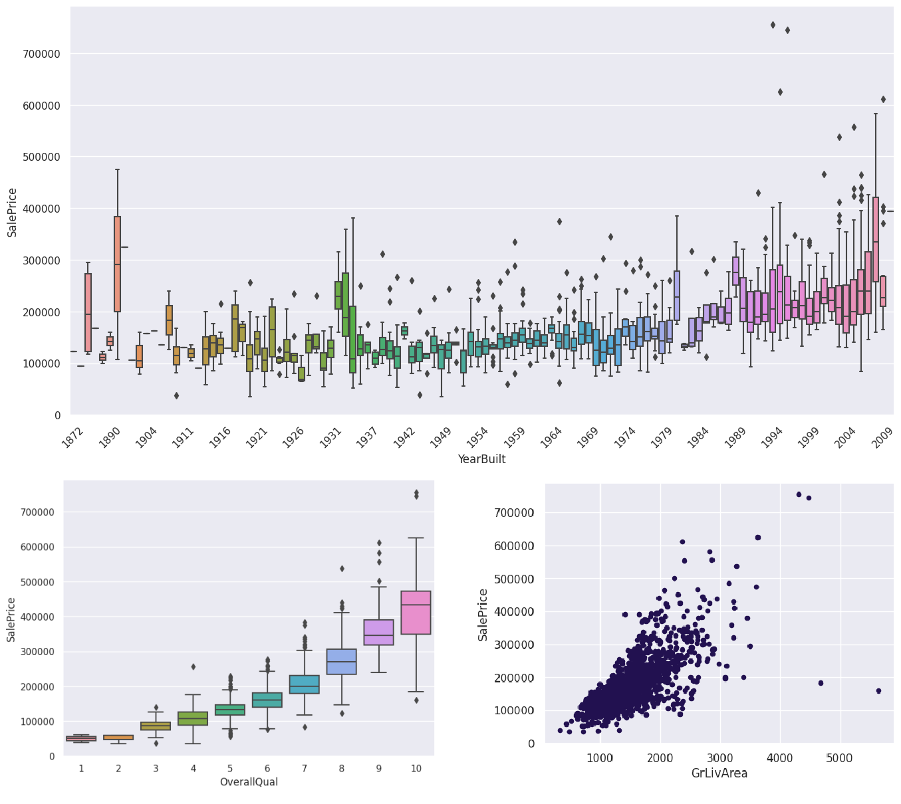

This project sought to build a property price prediction model using easily understandable factors such as Property Size, Year of Construction, Overall Property Quality, Property Condition, Above-Ground Living Area Size, Noteworthy Property Features, Garage Size, and Kitchen Quality. The goal was to create a model that could estimate property prices based on these user-friendly attributes, making it valuable for property valuation and market analysis in the real estate industry. [**Project Link**](https://github.com/ASatya-J107/Data_Science_Project_3_Regression/blob/main/Data_Science_Project_3_Regression.ipynb)

## Looker Studio - Sales Analytics Dashboard

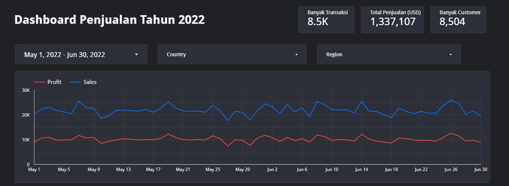
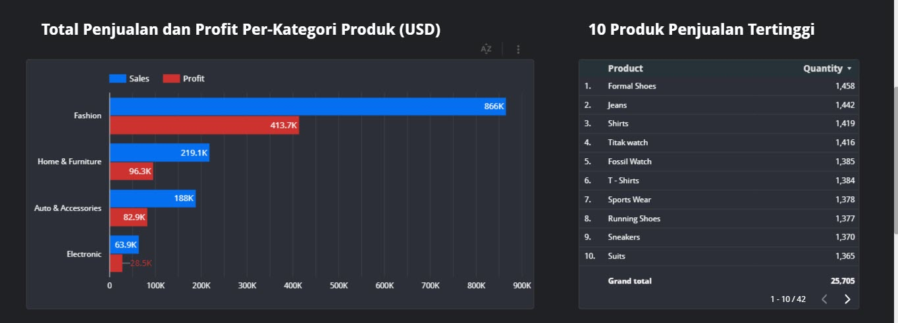

This project centered around the creation of a Looker Studio dashboard for sales data in the year 2022. The objective was to design a comprehensive and user-friendly visualization tool that provides a detailed overview of sales performance throughout the entire year. Through the dashboard, users can access key metrics, trends, and insights related to sales, enabling better-informed decision-making and a deeper understanding of sales patterns in 2022. The dashboard serves as a valuable resource for tracking and analyzing sales performance and forms a critical component of data-driven decision-making within the organization. [**Dashboard Link**](https://lookerstudio.google.com/embed/reporting/1119535a-bef2-4b2a-a47b-6cf5ae997edf/page/4HwXD)

## Exploratory Data Analysis - Mobile Phone Prices

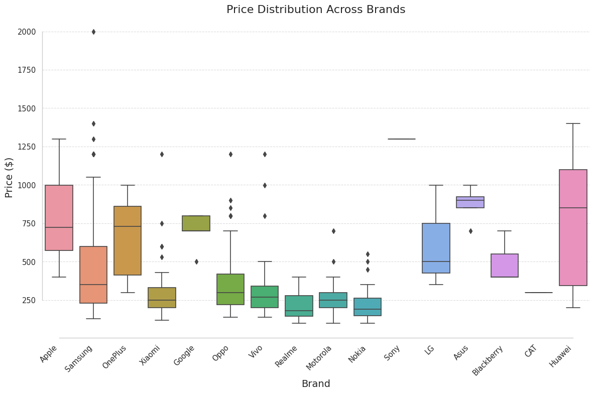
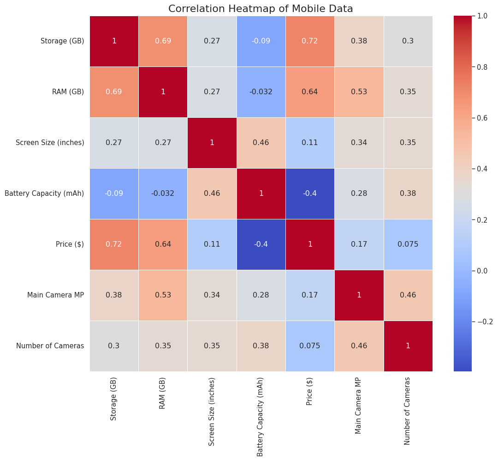

This project primarily involved performing an in-depth Exploratory Data Analysis (EDA) with a specific focus on mobile phone prices. Through this crucial process, we aimed to discover hidden patterns and gather valuable insights from the dataset. By carefully examining the data, we gained a thorough understanding of its structure, allowing us to interpret its complexities and extract meaningful information. [**Project Link**](https://github.com/ASatya-J107/Data_Science_Project_1_Exploratory_Data_Analysis/blob/main/Data_Science_Project_1_Exploratory_Data_Analysis.ipynb)
